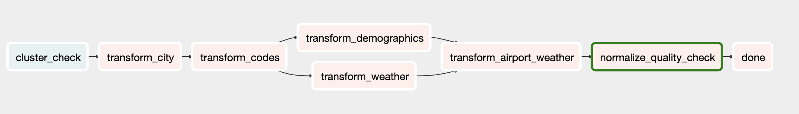
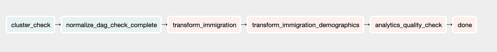

# Project description
- As more and more immigrants move to the US, people want quick and reliable ways to access certain information that can help inform their immigration, such as weather of the destination, demographics of destination. And for regulators to keep track of immigrants and their immigration meta data such as visa type, visa expire date, entry method to the US.

- Using the available data sources listed above, we build a Data Lake available on S3 that can be used to query for weather and demographics of popular immigration destinations, which could be useful for both immigrants and regulators. Regulators can also access data about individual immigrants, date of arrival to the US, visa expiry dates and method of entries to improve decision making.


# Data sources
- I94 Immigration Data: This data comes from the US National Tourism and Trade Office [Source](https://travel.trade.gov/research/reports/i94/historical/2016.html). This data records immigration records partitioned by month of every year.
- World temperature Data: This dataset comes from Kaggle [Source](https://www.kaggle.com/berkeleyearth/climate-change-earth-surface-temperature-data). Includes temperature recordings of cities around the world for a period of time
- US City Demographic Data: This dataset comes from OpenSoft [Source](https://public.opendatasoft.com/explore/dataset/us-cities-demographics/export/). Includes population formation of US states, like race and gender.
- Aiport Code table: [Source](https://datahub.io/core/airport-codes#data). Includes a collection of airport codes and their respective cities, countries around the world.


# Data Lake Star Schema designs
## The decision to build a Data Lake on S3 is due to:
- Ease of schema design, rely on schema-on-read
- Flexibility in adding / removing additional data
- Availability to a wide range of users with access to the S3 bucket


## Table designs
1. Normalized us city: built on city code data from raw airport and demographics data
2. Normalized us airport: built on raw airport data, filtered for US airports, joined with ``city`` table to get ``city_id``
    - Each airport can either be identified by ``icao_code`` or ``iata_code`` or both
3. Normalized country: built on country codes from I94 immigration dictionary
4. Normalized us state code: built on state codes from I94 immigration dictionary
5. Normalized us weather: built on global weather data, filtered for US cities, joined with ``city`` table to get ``city_id``
    - Filtered for weather data in the US at the latest date
    - The raw weather data only has temperatures on a fraction of all the cities in the US
    - Some cities in the data are duplicates, but that means they're on different states of the US. However the state is not available in the data, but instead we have the latitude - longitude coordinates. This issue is currently NOT addressed in this project, but in a production setting,we should join the latitude - longitude from weather dataset with this [data](https://simplemaps.com/data/us-cities), which includes city coordinates and their respective states
6. Normalized us demographics: built on raw demographics data, not much transform is needed
7. Denormalized airport weather: Joining weather data with airport location, to get the respective weather information for each US airports
8. Normalized immigrant: Information about individual immigrants, like age, gender, occupation, visa type, built on I94 Immigration dataset
9. Normalized immigration table: Information about immigration information, such as date of arrival, visa expiry date, airport, means of travel
10. Denormalized immigration demographics: Joining immigration with demographics data, to get the population of places where immigrants go


# AWS Infrastructure
- The AWS infrastructure is set up according to this [tutorial](https://aws.amazon.com/blogs/big-data/build-a-concurrent-data-orchestration-pipeline-using-amazon-emr-and-apache-livy/)
- Upload the CloudFormation script to create the resources, such as EC2 instance, RSD database for Airflow, security groups, S3 bucket
- Then connect to the EC2 instance:
```
sudo su
cd ~/airflow
source ~/.bash_profile
bash start.sh
bash run_dags.sh
```

# ETL
- dag_cluster: start the EMR cluster, and wait for all data transformation is finished, then terminate the cluster


- dag_normalize: wait for EMR cluster to be ready, then use Apache Livy REST API to create interactive Spark session on the cluster, submit a Spark script to read data from S3, do transformation and write the output to S3
    - This DAG handles normalized tables



- dag_analytics: wait for EMR cluster to be ready, and that normalized tables are processed, then read normalized tables to create analytics tables, and write to S3
    - This DAG handles immigration data, which is partitioned for 12 months from jan-2016 to dec-2016
    - To re-run this DAG, change the DAG name, then delete the existing DAG from Airflow, and refresh the UI



## Possible errors
- Livy session NOT started, restart EMR, restart Airflow scheduler


# Scenarios
- Data increase by 100x. read > write. write > read
    - Redshift: Analytical database, optimized for aggregation, also good performance for read-heavy workloads
    - Cassandra: Is optimized for writes, can be used to write online transactions as it comes in, and later aggregated into analytics tables in Redshift
    - Increase EMR cluster size to handle bigger volume of data


- Pipelines would be run on 7am daily. how to update dashboard? would it still work?
    - DAG retries, or send emails on failures
    - daily intervals with quality checks
    - if checks fail, then send emails to operators, freeze dashboard, look at DAG logs to figure out what went wrong


- Make it available to 100+ people
    - Redshift with auto-scaling capabilities and good read performance
    - Cassandra with pre-defined indexes to optimize read queries
